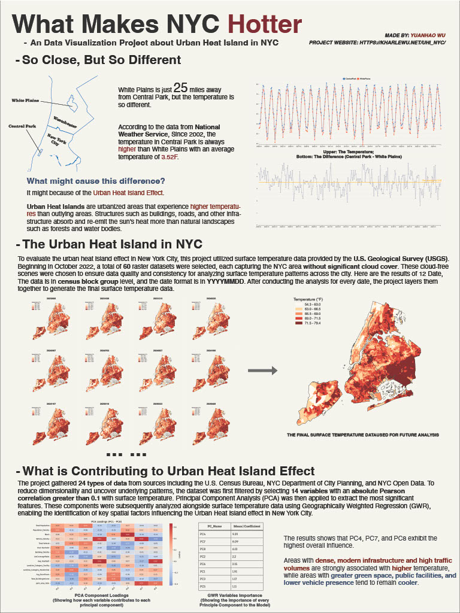

# 📦 What Makes NYC Hotter

This data visualization project focuses on the urban heat island effect in NYC. By introducing the urban heat island (UHI) phenomenon in New York City and exploring the potential factors that contribute to it, this project aims to provide viewers with a comprehensive understanding of UHI and offer insights for future urban planning and mitigation strategies.

**Project Link: https://kharlewu.net/uhi_nyc/**

## 🌟 Features

- Line charts of the temperature difference between Central Park and White Plains
- Map of the UHI Index in NYC
- More ...

## 🚀 Getting Started

### Prerequisites

```bash
pip install -r requirements.txt
```

### Installation

Clone the repository:

```bash
git clone https://github.com/KharleWu/UHI_NYC.git
```

## 🧱 Project Structure

```bash
UHI_NYC/
│
├── Code/                           # Code file
│   │
│   ├── Data_Processing.ipynb       # Including all the data processing and preliminary analysis
│   ├── Temperature_Line.html       # The HTML file for the temperature line chart (Data Source is in NWS_Temperature file)
│   ├── UHI_Index.html              # The HTML file for the the UHI_Index map (Data Source is in UHI_Index file)
│
├── NWS_Temperature/                # Data file for the temperature line chart
│   │
│   ├── Avg_Temperature_Final.csv   # The final data file used in the Temperature_Line.html
│   ├── Data/                       # The raw data file, sourced from the National Weather Service (NWS)                
│       │
│       ├── CentralPark.pdf
│       ├── CentralPark.xlxs
│       ├── WestChester.pdf
│       ├── WestChester.xlxs
│
├── UHI_Index/                      # Data file for the UHI_Index map
│   │
│   ├── UHI_Index.geojson           # The final data file used in the UHI_Index.html
│   ├── Classification.png          # A data distribution histogram showing the data analysis of the UHI_Index data
│   ├── Data/                       # The raw data file, sourced from the NYC Open Data and Climate Central
│       │
│       ├── CensusTracts.geojson    # The 2020 Census Tract GeoData of NYC, collected from NYC Open Data
│       ├── NY_Index.xlsx           # The UHI_Index data of NYC, collected from Climate Central
│
├── README.md
└── requirements.txt
```

## 🤝 Contributing
Pull requests are welcome. For major changes, please open an issue first to discuss what you would like to change.

## 🩷 The End
Thank you for clicking on this repository, hope you find the project helpful.

## Poster

